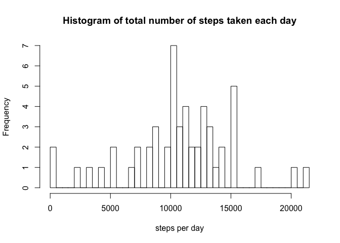
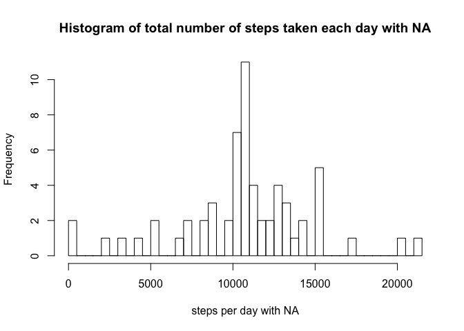
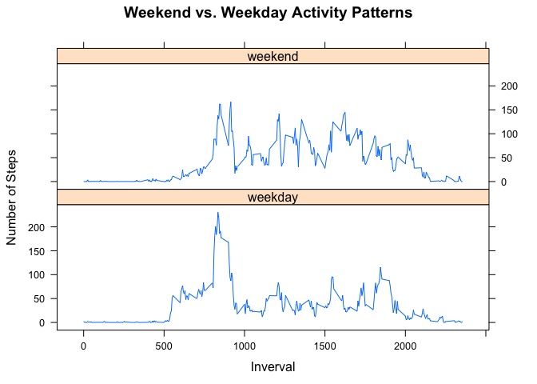

# Reproducible Research: Peer Assessment 1


## Loading and preprocessing the data

1. Load the Data

```r
# Unzip the archive
fileName <- unzip(file.path(".", "activity.zip"))

# Read the data from the unzipped file
rawData <- read.csv(fileName, header = TRUE)
```

2. Process / Transform the Data

```r
defDate <-as.POSIXct(strptime("1970-01-01 0000", "%Y-%m-%d %H%M"))
rawData$interval <- sprintf("%04d", rawData$interval)
rawData$intervalDate <- as.POSIXct(strptime(paste("1970-01-01", rawData$interval), "%Y-%m-%d %H%M"))
rawData$date <- as.Date(rawData$date,"%Y-%m-%d")

data <- rawData[!is.na(rawData$steps),]
```

## What is mean total number of steps taken per day?

1. Calculate the total number of steps taken per day

```r
aggData <- aggregate(steps ~ date, data = data, FUN = sum)
```

Make a histogram of the total number of steps taken each day


```r
hist(aggData$steps, breaks=nrow(aggData), xlab = "steps per day", main = "Histogram of total number of steps taken each day")
```

 

2. Calculate and report the mean and median of the total number of steps taken per day

```r
meanAgg <- mean(aggData$steps)
median <- median(aggData$steps)
```
The mean total number of steps in a given day is 10766.19.  
The median total number of steps taken per day is 10765.


## What is the average daily activity pattern?

1. Make a time series plot (i.e. type = "l") of the 5-minute interval (x-axis) and the average number of steps taken, averaged across all days (y-axis)

```r
intervalData <- tapply(data$steps, data$interval, mean) 

# make a time series plot of the 5-min interval
plot(unique(data$interval), intervalData, xlab = "Interval", ylab = "Average Steps", 
    type = "l")
```

 

2. Which 5-minute interval, on average across all the days in the dataset, contains the maximum number of steps?

```r
maxInterval <- data[which.max(intervalData), "interval"]
```

The 5-minute interval which has the maximum number of steps is 0835.

## Imputing missing values

Note that there are a number of days/intervals where there are missing values (coded as NA). The presence of missing days may introduce bias into some calculations or summaries of the data.

1. Calculate and report the total number of missing values in the dataset (i.e. the total number of rows with NAs)

```r
missingCount <- nrow(rawData[is.na(rawData$steps),])
```
The total number of missing values is 2304.

2. Devise a strategy for filling in all of the missing values in the dataset. The strategy does not need to be sophisticated. For example, you could use the mean/median for that day, or the mean for that 5-minute interval, etc.


```r
index <- is.na(rawData$steps)
# set mean for that 5-minute interval where it is NA
rawData$steps[index] <- intervalData[rawData$interval[index]]
```

3. Create a new dataset that is equal to the original dataset but with the missing data filled in.


```r
missingDataIncluded <- rawData
```

4.Make a histogram of the total number of steps taken each day and Calculate and report the mean and median total number of steps taken per day. Do these values differ from the estimates from the first part of the assignment? What is the impact of imputing missing data on the estimates of the total daily number of steps?

```r
missingAggData <- aggregate(steps ~ date, data = missingDataIncluded, FUN = sum)
```


```r
hist(missingAggData$steps, breaks=nrow(missingAggData), xlab = "steps per day with NA", main = "Histogram of total number of steps taken each day with NA" )
```

 


```r
meanAgg <- mean(missingAggData$steps)
median <- median(missingAggData$steps)
```
The mean total number of steps with `NA` in a given day is 10766.19.  
The median total number of steps with `NA` taken per day is 10766.19.


```r
summary(aggData)
```

```
##       date                steps      
##  Min.   :2012-10-02   Min.   :   41  
##  1st Qu.:2012-10-16   1st Qu.: 8841  
##  Median :2012-10-29   Median :10765  
##  Mean   :2012-10-30   Mean   :10766  
##  3rd Qu.:2012-11-16   3rd Qu.:13294  
##  Max.   :2012-11-29   Max.   :21194
```

```r
summary(missingAggData)
```

```
##       date                steps      
##  Min.   :2012-10-01   Min.   :   41  
##  1st Qu.:2012-10-16   1st Qu.: 9819  
##  Median :2012-10-31   Median :10766  
##  Mean   :2012-10-31   Mean   :10766  
##  3rd Qu.:2012-11-15   3rd Qu.:12811  
##  Max.   :2012-11-30   Max.   :21194
```

Now that mean interval step value has been inserted where the step was `NA`, the median and mean are equal and match the mean od the dataset without the `NA` step values

## Are there differences in activity patterns between weekdays and weekends?

1. Create a new factor variable in the dataset with two levels ??? ???weekday??? and ???weekend??? indicating whether a given date is a weekday or weekend day.

```r
factor <- weekdays(missingDataIncluded$date, abbreviate = FALSE)

factor[factor == "Sunday" | factor == "Saturday"] <- "weekend"
factor[factor != "weekend"] <- "weekday"
missingDataIncluded <- cbind(missingDataIncluded, day = factor)
```

2. Make a panel plot containing a time series plot (i.e. type = "l") of the 5-minute interval (x-axis) and the average number of steps taken, averaged across all weekday days or weekend days 

```r
aggMiss <- aggregate(steps ~ interval + day, missingDataIncluded, mean)
library(lattice)
xyplot(steps ~ as.integer(interval) | day, data = aggMiss, type = "l", layout = c(1, 2), ylab = "Number of Steps", xlab = "Inverval", main = "Weekend vs. Weekday Activity Patterns")
```

 


